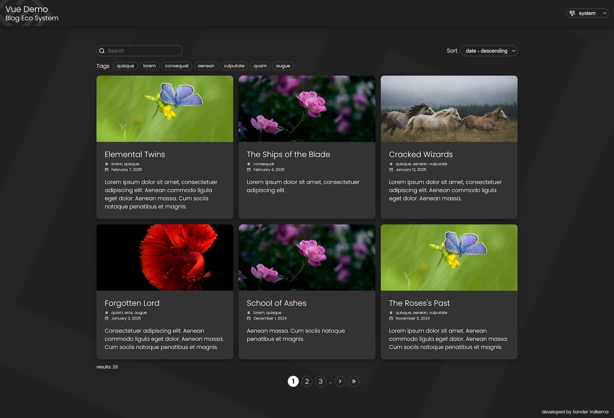

# Introduction

This project showcases a blog eco system build with:
- vue3 composition
- typescript
- vue-router
- pina 
- vite
- scss

The code is tested in chrome en firefox desktop browsers in both mobile and desktop view.

Screenshot:



# Features

- Blog filtering by search text
- Blog sorting by title, date, etc...
- Blog filtering by tags
- Color theme selection
- Pagination
- And more

# Setup & Usage

Run these commands: 

```bash
npm install

npm run build

npm run preview
```
Open the website with url:  `http://localhost:4173`

# Author
Developed by Sander Valkema

